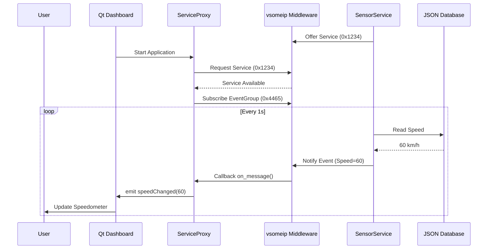

# Khóa học Ngắn hạn: Phát triển Ứng dụng AUTOSAR Adaptive với vsomeip và Qt

Tài liệu này cung cấp hướng dẫn cô đọng và đầy đủ để phát triển hệ thống mô phỏng xe hơi sử dụng kiến trúc AUTOSAR Adaptive, giao thức SOME/IP (vsomeip) và giao diện Qt.

---

## Bài 1: Tổng quan AUTOSAR Adaptive và giới thiệu vsomeip

### 1. Lý thuyết
*   **Kiến trúc SOA (Service-Oriented Architecture):** Hệ thống được chia thành các dịch vụ (Services) cung cấp chức năng qua mạng thay vì kết nối cứng.
*   **Cấu trúc ara:::** Namespace chuẩn của AUTOSAR Adaptive (VD: `ara::com` cho giao tiếp, `ara::core` cho các tiện ích cốt lõi).
*   **Manifest:**
    *   *ApplicationManifest:* Định nghĩa thông tin ứng dụng.
    *   *ExecutionManifest:* Định nghĩa cách ứng dụng chạy (startup, dependency).
*   **Mô hình:** Service (Server) cung cấp dữ liệu/hàm, Client sử dụng chúng. Giao tiếp qua middleware (ở đây là vsomeip).
*   **vsomeip:** Thư viện C++ mã nguồn mở của COVESA triển khai giao thức SOME/IP.

### 2. Cài đặt môi trường
*   Cài đặt dependencies: Boost, CMake, build-essential.
*   Build vsomeip:
    ```bash
    git clone https://github.com/COVESA/vsomeip.git
    cd vsomeip && mkdir build && cd build
    cmake .. && make && sudo make install
    ```

### 3. Ví dụ thực hành

#### Ví dụ 1: Code ngắn gọn nhất (Hello World Service)
Tạo một Service đơn giản chỉ khởi tạo và offer service ID.

**File: service_minimal.cpp**
```cpp
#include <vsomeip/vsomeip.hpp>

#define SERVICE_ID 0x1234
#define INSTANCE_ID 0x5678

int main() {
    // 1. Tạo ứng dụng vsomeip
    auto app = vsomeip::runtime::get()->create_application("hello_service");
    
    // 2. Khởi tạo
    app->init();
    
    // 3. Cung cấp (Offer) dịch vụ
    app->offer_service(SERVICE_ID, INSTANCE_ID);
    
    // 4. Chạy ứng dụng (Blocking)
    app->start();
}
```
*Yêu cầu:* File cấu hình `vsomeip.json` phải định nghĩa `service_id` và `instance_id` này.

---

#### Ví dụ 2: Nâng cao - Client-Server đầy đủ với Request/Response
Code đầy đủ xử lý bản tin, cấu trúc theo dạng module tách biệt logic.

**File: service_advanced.cpp (Server)**
```cpp
#include <vsomeip/vsomeip.hpp>
#include <iostream>
#include <thread>

// Module Constants
const vsomeip::service_t SAMPLE_SERVICE_ID = 0x1234;
const vsomeip::instance_t SAMPLE_INSTANCE_ID = 0x5678;
const vsomeip::method_t SAMPLE_METHOD_ID = 0x0001;

class HelloService {
public:
    HelloService() : app_(vsomeip::runtime::get()->create_application("WorldService")) {}

    bool init() {
        if (!app_->init()) return false;
        
        // Đăng ký callback xử lý message
        app_->register_message_handler(SAMPLE_SERVICE_ID, SAMPLE_INSTANCE_ID, SAMPLE_METHOD_ID,
            std::bind(&HelloService::on_message, this, std::placeholders::_1));
            
        return true;
    }

    void start() {
        app_->offer_service(SAMPLE_SERVICE_ID, SAMPLE_INSTANCE_ID);
        std::cout << "[Service] Service Offered: " << std::hex << SAMPLE_SERVICE_ID << std::endl;
        app_->start();
    }

private:
    std::shared_ptr<vsomeip::application> app_;

    // Module xử lý logic
    void on_message(const std::shared_ptr<vsomeip::message> &_msg) {
        std::string payload_str = get_payload_string(_msg->get_payload());
        std::cout << "[Service] Received: " << payload_str << std::endl;

        // Tạo response
        std::shared_ptr<vsomeip::message> resp = vsomeip::runtime::get()->create_response(_msg);
        set_payload_string(resp, "Hello from Service! " + payload_str);
        
        app_->send(resp);
    }

    std::string get_payload_string(const std::shared_ptr<vsomeip::payload> &_pl) {
        return std::string(reinterpret_cast<const char*>(_pl->get_data()), _pl->get_length());
    }

    void set_payload_string(std::shared_ptr<vsomeip::message> &_msg, const std::string &_data) {
        std::shared_ptr<vsomeip::payload> pl = vsomeip::runtime::get()->create_payload();
        std::vector<vsomeip::byte_t> pl_data(_data.begin(), _data.end());
        pl->set_data(pl_data);
        _msg->set_payload(pl);
    }
};

int main() {
    HelloService service;
    if (service.init()) {
        service.start();
    }
}
```

**Giải thích code:**
*   **Module Constants:** Định nghĩa rõ ràng ID cho Service, Instance, Method để dễ quản lý.
*   **Class Wrapper:** Đóng gói logic vào class `HelloService` thay vì viết trôi nổi trong main.
*   **register_message_handler:** Đăng ký hàm callback khi có request gửi đến Method ID cụ thể.
*   **Payload Helpers:** Các hàm phụ trợ để chuyển đổi giữa chuỗi string và binary data của SOME/IP.
*   **Logic:** Nhận message -> Parse -> Xử lý -> Tạo Response -> Gửi lại.

---

## Bài 2: Mô phỏng cơ sở dữ liệu ảo và phát triển Service Layer

### 1. Lý thuyết
*   **Virtual DB:** Sử dụng file JSON để lưu trữ trạng thái xe (Speed, Battery, Temp) thay vì cảm biến thật.
*   **ara::com API Simulation:** Vì `ara::com` là API sinh ra bởi toolchain, ta sẽ tự viết các wrapper class mô phỏng hành vi của nó (Skeleton/Proxy).
*   **ara::core::Future:** Cơ chế xử lý bất đồng bộ (giống `std::future`).
*   **ara::log:** Ghi log theo chuẩn (Severity levels).

### 2. Ví dụ thực hành

#### Ví dụ 1: Code ngắn gọn nhất (Đọc JSON Database)
Đọc giá trị tốc độ từ file JSON.

**File: db_minimal.cpp**
```cpp
#include <iostream>
#include <fstream>
#include <nlohmann/json.hpp> // Cần thư viện nlohmann/json

using json = nlohmann::json;

int main() {
    std::ifstream f("vehicle_data.json");
    if (!f.is_open()) return 1;
    
    json data = json::parse(f);
    
    // Bắt buộc: Lấy dữ liệu với key cụ thể
    int speed = data["speed"];
    std::cout << "Current Speed: " << speed << " km/h" << std::endl;
    
    return 0;
}
```

---

#### Ví dụ 2: Nâng cao - Dashboard Service với cấu trúc ara::
Mô phỏng đầy đủ lớp Service Layer, đọc DB và gửi event.

**File: dashboard_service_impl.hpp**
```cpp
#include <vsomeip/vsomeip.hpp>
#include <nlohmann/json.hpp>
#include <fstream>
#include <thread>
#include <chrono>

// Giả lập namespace ara::core và ara::log
namespace ara {
    namespace log {
        void LogInfo(const std::string& msg) { std::cout << "[ARA_INFO] " << msg << std::endl; }
        void LogError(const std::string& msg) { std::cerr << "[ARA_ERROR] " << msg << std::endl; }
    }
}

// Module Database
class VehicleDatabase {
public:
    struct VehicleData {
        int speed;
        int battery;
        std::string drive_mode;
    };

    static VehicleData load() {
        std::ifstream f("vehicle_db.json");
        if (!f.is_open()) return {0, 0, "unknown"};
        nlohmann::json j;
        f >> j;
        return {j.value("speed", 0), j.value("battery", 100), j.value("drive_mode", "ECO")};
    }
};

// Module Service (Skeleton)
class DashboardServiceSkeleton {
public:
    DashboardServiceSkeleton() : app_(vsomeip::runtime::get()->create_application("DashboardService")) {}

    void init() {
        app_->init();
        // Giả sử Event Group ID là 0x4465
        std::set<vsomeip::eventgroup_t> groups;
        groups.insert(0x4465);
        app_->offer_event(0x1234, 0x5678, 0x8001, groups); // Service, Instance, EventID
        
        // Luồng cập nhật dữ liệu định kỳ (Simulation)
        std::thread([this]() {
            while(true) {
                auto data = VehicleDatabase::load();
                this->publishSpeed(data.speed);
                std::this_thread::sleep_for(std::chrono::seconds(1));
            }
        }).detach();
    }

    void offer() {
        app_->offer_service(0x1234, 0x5678);
        app_->start();
    }

private:
    std::shared_ptr<vsomeip::application> app_;

    void publishSpeed(int speed) {
        // Serialize dữ liệu
        std::shared_ptr<vsomeip::payload> pl = vsomeip::runtime::get()->create_payload();
        std::vector<vsomeip::byte_t> data;
        data.push_back((speed >> 24) & 0xFF);
        data.push_back((speed >> 16) & 0xFF);
        data.push_back((speed >> 8) & 0xFF);
        data.push_back(speed & 0xFF);
        pl->set_data(data);

        // Gửi Event (Notify)
        app_->notify(0x1234, 0x5678, 0x8001, pl);
        ara::log::LogInfo("Published Speed: " + std::to_string(speed));
    }
};
```
**Giải thích code:**
*   **Namespace ara::log:** Wrapper đơn giản để log thông tin chuẩn hóa.
*   **VehicleDatabase:** Module tách biệt chịu trách nhiệm đọc/ghi JSON. Giúp tách logic dữ liệu khỏi logic giao tiếp.
*   **DashboardServiceSkeleton:** Đóng vai trò là Server (Skeleton).
    *   *offer_event:* Khai báo event sẽ được gửi.
    *   *Thread update:* Mô phỏng vòng lặp của cảm biến, đọc DB liên tục và cập nhật giá trị.
    *   *publishSpeed:* Serialize số nguyên thành bytes và bắn ra mạng qua `app_->notify`.

---

## Bài 3: Tích hợp Qt UI với Service Backend

### 1. Lý thuyết
*   **ServiceProxy:** Đại diện của Service phía Client.
*   **Qt Signals/Slots:** Cơ chế cốt lõi để cập nhật UI khi có dữ liệu từ backend.
*   **Mapping:** Chuyển đổi dữ liệu thô (raw bytes từ vsomeip) thành dữ liệu hiển thị (QString, int cho ProgressBar).

### 2. Ví dụ thực hành

#### Ví dụ 1: Code ngắn gọn nhất (Qt Console Client)
Client chạy nền (không có GUI phức tạp) kết nối vsomeip.

**File: qt_client_minimal.cpp**
```cpp
#include <QCoreApplication>
#include <vsomeip/vsomeip.hpp>
#include <iostream>

int main(int argc, char *argv[]) {
    QCoreApplication a(argc, argv);
    
    auto app = vsomeip::runtime::get()->create_application("QtClient");
    app->init();
    
    // Đăng ký nhận message
    app->register_message_handler(0x1234, 0x5678, 0x8001, [](const std::shared_ptr<vsomeip::message>& msg){
        std::cout << "Received Event in Qt Loop!" << std::endl;
    });

    app->request_service(0x1234, 0x5678);
    
    // Lưu ý: vsomeip app->start() chặn luồng, nên cần chạy thread riêng 
    // hoặc tích hợp vào event loop (phức tạp hơn). Ở ví dụ ngắn gọn, ta dùng thread.
    std::thread([&app](){ app->start(); }).detach();
    
    return a.exec();
}
```

---

#### Ví dụ 2: Nâng cao - Qt GUI Dashboard (Proxy & UI Update)
Ứng dụng Qt Widget đầy đủ, sử dụng class Proxy để quản lý kết nối và update UI an toàn.

**File: dashboard_proxy.h**
```cpp
#ifndef DASHBOARD_PROXY_H
#define DASHBOARD_PROXY_H

#include <QObject>
#include <vsomeip/vsomeip.hpp>
#include <thread>

// Kế thừa QObject để dùng Signals
class DashboardProxy : public QObject {
    Q_OBJECT
public:
    DashboardProxy();
    void start();

signals:
    void speedChanged(int newSpeed); // Signal bắn sang UI

private:
    std::shared_ptr<vsomeip::application> app_;
    void on_event(const std::shared_ptr<vsomeip::message> &_msg);
};
#endif
```

**File: dashboard_proxy.cpp**
```cpp
#include "dashboard_proxy.h"

DashboardProxy::DashboardProxy() {
    app_ = vsomeip::runtime::get()->create_application("QtDashboard");
}

void DashboardProxy::start() {
    if (!app_->init()) return;

    // Đăng ký nhận Event Speed (0x8001)
    app_->register_message_handler(0x1234, 0x5678, 0x8001, 
        std::bind(&DashboardProxy::on_event, this, std::placeholders::_1));

    // Yêu cầu Service và Event Group
    std::set<vsomeip::eventgroup_t> groups;
    groups.insert(0x4465);
    app_->request_event(0x1234, 0x5678, 0x8001, groups);
    app_->request_service(0x1234, 0x5678);

    // Chạy vsomeip trên thread riêng để không chặn Qt UI Main Thread
    std::thread([this](){ app_->start(); }).detach();
}

void DashboardProxy::on_event(const std::shared_ptr<vsomeip::message> &_msg) {
    // Deserialize dữ liệu
    auto payload = _msg->get_payload();
    vsomeip::byte_t *data = payload->get_data();
    int speed = (data[0] << 24) | (data[1] << 16) | (data[2] << 8) | data[3];

    // Emit signal để cập nhật UI
    // Lưu ý: vsomeip callback chạy trên thread khác, Qt Signal/Slot tự động xử lý thread-safe khi dùng QueuedConnection (mặc định)
    emit speedChanged(speed);
}
```

**File: main_window.cpp (Tích hợp)**
```cpp
// Trong hàm khởi tạo MainWindow
DashboardProxy *proxy = new DashboardProxy();

// Kết nối Signal từ Proxy vào UI Slot
QObject::connect(proxy, &DashboardProxy::speedChanged, this, [this](int speed){
    ui->speedLabel->setText(QString::number(speed) + " km/h");
    ui->speedProgressBar->setValue(speed);
    
    // Logic đổi màu dựa trên tốc độ (Mapping logic)
    if (speed > 80) ui->speedLabel->setStyleSheet("color: red;");
    else ui->speedLabel->setStyleSheet("color: green;");
});

proxy->start();
```

**Giải thích code:**
*   **Separation of Concerns:** `DashboardProxy` chỉ lo việc giao tiếp mạng, `MainWindow` chỉ lo hiển thị.
*   **Thread Safety:** vsomeip chạy blocking trên thread riêng. Khi có dữ liệu, callback `on_event` được gọi. Ta dùng `emit speedChanged` để đẩy dữ liệu sang luồng UI của Qt một cách an toàn.
*   **Data Mapping:** Chuyển đổi byte array thành số nguyên `int`, sau đó Qt chuyển thành `QString` để hiển thị.

---

## Bài 4: Trình diễn dự án và đóng gói sản phẩm

### 1. Lý thuyết
*   **Quy trình chuẩn:**
    1.  *Use Case:* Người lái xem tốc độ.
    2.  *Component:* Dashboard App (Client) <-> vsomeip <-> Sensor Service (Server).
    3.  *Sequence:* App start -> Find Service -> Subscribe Event -> OnChange -> Update UI.
*   **Đóng gói:** Cần copy các thư viện động (.so), file cấu hình (json), và executable vào cùng cấu trúc thư mục.

### 2. Ví dụ thực hành

#### Ví dụ 1: Sơ đồ cấu trúc dự án & Mermaid Diagram (Code mô tả hệ thống)
Sử dụng Mermaid để vẽ Sequence Diagram cho dự án.



#### Ví dụ 2: Nâng cao - Script Build & Deploy tự động (CMake & Shell)
Code CMakeLists.txt mô đun hóa và script chạy demo.

**File: CMakeLists.txt (Gốc)**
```cmake
cmake_minimum_required(VERSION 3.10)
project(AutosarCourseDemo)

set(CMAKE_CXX_STANDARD 14)

find_package(vsomeip3 REQUIRED)
find_package(Qt5 COMPONENTS Widgets Core REQUIRED)
find_package(nlohmann_json REQUIRED)

# 1. Build Service
add_executable(dashboard_service service/main.cpp)
target_link_libraries(dashboard_service vsomeip3 nlohmann_json::nlohmann_json)

# 2. Build Qt Client
add_executable(dashboard_ui client/main.cpp client/dashboard_proxy.cpp)
target_link_libraries(dashboard_ui vsomeip3 Qt5::Widgets Qt5::Core)

# 3. Copy Config Files (Post-build)
file(COPY ${CMAKE_SOURCE_DIR}/config/vehicle_db.json DESTINATION ${CMAKE_BINARY_DIR})
file(COPY ${CMAKE_SOURCE_DIR}/config/vsomeip-service.json DESTINATION ${CMAKE_BINARY_DIR})
file(COPY ${CMAKE_SOURCE_DIR}/config/vsomeip-client.json DESTINATION ${CMAKE_BINARY_DIR})
```

**File: run_demo.sh**
```bash
#!/bin/bash
# Script chạy mô phỏng hoàn chỉnh

# Cấu hình biến môi trường cho vsomeip
export VSOMEIP_CONFIGURATION=./vsomeip-service.json
export VSOMEIP_APPLICATION_NAME=DashboardService

# 1. Chạy Service ở background
echo "Starting Service..."
./dashboard_service &
SERVICE_PID=$!

sleep 2 # Đợi service khởi động

# 2. Chạy Client UI
echo "Starting UI..."
export VSOMEIP_CONFIGURATION=./vsomeip-client.json
export VSOMEIP_APPLICATION_NAME=QtDashboard
./dashboard_ui

# 3. Dọn dẹp khi tắt UI
kill $SERVICE_PID
echo "Demo stopped."
```

**Giải thích:**
*   **CMake:** Tự động tìm thư viện, biên dịch cả Service và Client, và quan trọng nhất là copy file cấu hình (.json) vào thư mục build.
*   **Shell Script:** Tự động hóa quy trình test: Chạy Service -> Chờ -> Chạy Client -> Tự kill Service khi Client tắt. Đây là cách đóng gói đơn giản nhất để trình diễn sản phẩm.
